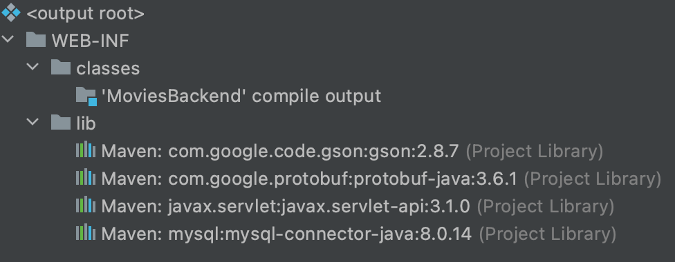

# Servlets

In this lesson we'll talk about some broader concepts related to how the internet as a whole works, how servlets fit
into that picture, and have a brief discussion of Java web servers.

## The Request/Response Lifecycle


At a high level, most internet communication consists of requests and responses. A client (for example a browser) makes
a request (for example, when clicking a link) and based on that request, the server sends a response (JSON, plain text,
even entire files!).

It is important to understand that all of our Java code will reside
*server-side* (as opposed to *client-side*, which is where our JavaScript runs). This means that a user visiting our
website will not know that our server is running Java, just that when they ask for movies they get movies!

In this lesson, and the rest of this module, we'll discuss some libraries and APIs that allow us to work with requests
and responses at the high level described; that is, we won't have to handle any of the lower level networking details
that are necessary for the requests to get to our server, or for the responses to make it back to the browser.

## Servlets

First we'll introduce the concept of a servlet, and the prerequisites to using them, then talk about how to create and
use servlets.

A servlet is a Java class that extends the `HttpServlet` class from the servlet library. A servlet's most basic
functionality is to handle HTTP requests and responses. Servlets also allow us to serve data, so our Javascript frontend
can show the user what is available (ie: movies).

In order to use servlets, we'll need several things:

- The servlet libraries
- A Web Server that will interact our servlet classes

We can use Maven to add the Java servlet dependencies within our `pom.xml`:

```xml

<dependency>
    <groupId>javax.servlet</groupId>
    <artifactId>javax.servlet-api</artifactId>
    <version>3.1.0</version>
</dependency>
```

## Tomcat

While there are other alternatives, we will be using [Apache Tomcat](tomcat.md)
as our servlet container. Tomcat is the piece of software that handles the lower level networking details of accepting
HTTP requests and forwarding them on to our code that can interact with the requests at a higher level.

Tomcat expects our application to be deployed as a WAR (Web ARchive). This is a JAR file with additional structure.

Here is what a WAR file looks like:



It is important to keep in mind that the `.war` file that is created from our project will have a different structure
from the project itself. While it's important to understand what a `war` file is and how it is structured, most of the
time we won't be interacting with the `war` file directly, as it is an
**artifact**, a byproduct of our source code, but not the source code itself.

This is what our project structure will look like, and this is an example of a typical Maven project structure, although
you might encounter slightly different conventions elsewhere:

```txt
./               <-- project root
pom.xml
src/main/
    java/        <-- your classes, including servlets, go here
    webapp/      <-- web *facet* | static files / assets
        css/
        js/
        img/
        WEB-INF/ <-- non-public files go here
```

In addition to this project structure, we will need to configure IntelliJ to run our project. See [here][tomcat-config]
for the specifics of how to set this up.

## Using Servlets

Broadly speaking, we'll need to do these three things when creating a servlet:

1. Create a class the extends `HttpServlet`

1. Annotate the class with the `@WebServlet` annotation to specify which URL it maps to

   !!!note "web.xml"
   An alternative to configuration with annotations is with a configuration file named `web.xml`. You may see examples
   of this on Stack Overflow or when searching for servlet related questions. At Codeup, we'll stick to annotation based
   configuration, as it is less verbose, and a little more modern.

1. Implement a `protected` `doGet` and/or `doPost` method that accepts two parameters: `HttpServletRequest`,
   and `HttpServletResponse`

Let's take a look at an example:

```java
import java.io.*;
import javax.servlet.*;
import javax.servlet.http.*;

@WebServlet(name = "HelloWorldServlet", urlPatterns = "/hello-world")
public class HelloWorldServlet extends HttpServlet {

    @Override
    protected void doGet(HttpServletRequest request, HttpServletResponse response) throws ServletException, IOException {
        response.setContentType("text/html");
        PrintWriter out = response.getWriter();
        out.println("Hello, world!");
    }

}
```

We start with the necessary imports for the classes we are using. Next we encounter the `WebServlet` annotation. This
allows us to specify what URL this servlet should handle. In this case, we specified `/hello-world`, meaning that this
servlet will be invoked for any request for our base domain (this will be
`localhost:8080` by default locally) + `/hello-world`. The full URL would look like `http://localhost:8080/hello-world`.
If we deployed our project to a live domain, it might look like: `https://my-awesome-project.com/hello-world`.

Below the annotation, we have our class definition. The class must extend
`HttpServlet`. We can name this class whatever we like, but it should be a descriptive name. A common convention is to
suffix the class name with
`Servlet`. Here are some example servlet names:

- `ViewAllProductsServlet`
- `UserLoginServlet`
- `UpdateProfileServlet`

Inside of our class we implement a `doGet` method. Notice that this method contains the `Override` annotation, meaning
it is overriding the definition from a parent class. The methods we choose to implement in our servlet define what HTTP
verbs the servlet will handle. Most commonly, this will be either `GET`
(`doGet`) or `POST`(`doPost`). Regardless of the HTTP verb, the method will define two parameters representing the
incoming request (`HttpServletRequest`)
and the response (`HttpServletResponse`).

In the body of the `doGet` method, we set the content type of the request, get a reference to a `PrintWriter` object,
and use that object to send write our data (JSON, text, or files) as a response. You can think of this `PrintWriter`
object like `System.out.println`, but for printing to the response that we send to the browser, as opposed to the
console.

!!!note ""
We'll map each servlet we create to a URL, meaning that each unique URL in our application will have a servlet
associated with it, and to add a new URL, we would need to create a new servlet.

## Servlet Life Cycle

It is important to have a conceptual understanding of how our servlet classes are working. Unlike our past Java
projects, our application does *not* have a
`main` method. Instead, Tomcat will be taking over control (initially) for us.

```
                                Tomcat Starts
                                      |
                                      v
                              Servlet is Created
                                      |
                                      v
           +->> request >>>>   doGet is called    >>>> response >>-+
           |                                                       |
           ^                                                       v
           ^                                                       v
           |                                                       |
           +-<< request <<<<       Client         <<<< response <<-+
```

The process for a GET request looks like this:

1. The Tomcat web server starts up
1. A request for a specific URL comes to the web server (e.g. `/hello-world`)
    - If the servlet that is mapped to that URL (e.g. our `HelloWorldServlet`)
      does not exist, it is created
    - If the servlet has already been created, we'll use the existing one
1. The `doGet` method is called and the response is sent

A similar process is followed for POST requests, but with the `doPost` method, instead of `doGet`.

The most important implication of this process is that the objects created from our servlet classes persist between
requests. This means that we can create instance properties that can be used across multiple requests. In addition, we
should be careful to clean up any resources we use on a single request
(e.g. file handles).

---

## Working with Servlets

After implementing the class and a `doGet` (or `doPost`) method, most of our work will be done with the `request`
and `response` objects.

Let's take a look at some common methods on both objects:

### `request`

`getParameter`

- Get a parameter passed in the GET or POST request

  This method will be used **very** frequently. It allows us to extract a value for a parameter submitted along with a
  request. For example, we could use this method to extract the values of 4 and "price" for the following GET request
  URL (assuming we have a servlet with a `doGet` method mapped to the URL):

    ```
    /product-search?page=4&sort=price
    ```

    ```java
    String sortBy = request.getParameter("sort");
    int currentPage = (int) request.getParameter("page");
    ```

*Note that any values we obtain using this method will be strings; if the values are of a different type, we'll need to
convert them ourselves in our application code.*

### `response`

`getWriter`

- Get an instance of `java.io.PrintWriter` that can be used to write to the HTTP response

  This is like `System.out.println`, but for printing content to the response that will be delivered to the user's
  browser, instead of to the console.

    ```java
    // inside of a doGet or doPost method
    System.out.println("You will see this in the console");
    response.getWriter().println("You should see this in the browser");
    ```

`sendRedirect`

- Redirect to a different location

  We might use this, for example, to redirect our users to the login page if they try to visit a page they must first be
  logged in to visit.

    ```java
    response.sendRedirect("/login");
    ```

## Summary

In order to use servlets we'll need both of the following:

- The Java EE servlet libraries
- a web server with a web container configured to interact with our servlet classes

We will use **Maven** to add the servlet library dependencies in our `pom.xml`,
**IntelliJ** to compile and package our application as a WAR, and **Tomcat** to serve our application.

## Further Resources

- [Introduction to Servlets](https://www.youtube.com/watch?v=CRvcm7GKrF0&t=5s)
- [Java Servlets](https://en.wikipedia.org/wiki/Java_servlet)
- [Writing Servlet Methods](https://docs.oracle.com/javaee/5/tutorial/doc/bnafv.html)

##Next Up: [Starting the Movies Backend](3-start-movies.md)